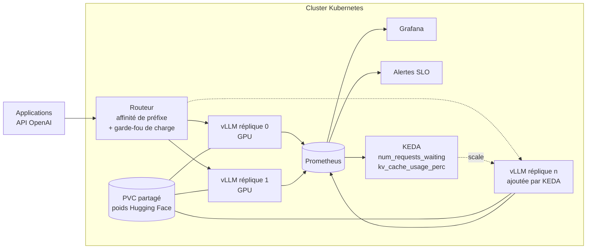

# vLLM Production Serving


Mettre un LLM open source en production, ce n'est pas lancer `vllm serve`. C'est répondre à quatre questions avant la mise en service :

1. **Combien de GPU ?** Le cache KV, pas les poids, fixe la concurrence.
2. **Comment répartir la charge ?** Un round-robin gaspille le cache de préfixe.
3. **Quand ajouter une réplique ?** Le CPU ne dit rien d'un serveur GPU ; la file d'attente, si.
4. **Comment savoir que ça va bien ?** TTFT et latence inter-tokens, pas le taux d'erreur seul.

Ce dépôt apporte une réponse outillée et testée à chacune, sur le modèle de [vLLM production-stack](https://github.com/vllm-project/production-stack) et [llm-d](https://github.com/llm-d/llm-d), en version compacte et lisible.

## Architecture



| Brique | Fichier | Rôle |
|---|---|---|
| Dimensionnement | `serving/capacity.py` | Mémoire des poids, octets de cache KV par token, requêtes simultanées possibles |
| Profils de déploiement | `profiles/*.yaml`, `serving/render_args.py` | Paramètres validés avant d'atteindre un GPU, commande `vllm serve` générée |
| Routeur | `router/router.py` | Affinité de préfixe par hachage rendezvous, bascule sur la réplique la moins chargée, exclusion des répliques en panne |
| Autoscaling | `deploy/k8s/keda-autoscaling.yaml` | Échelle sur `vllm:num_requests_waiting` et `vllm:kv_cache_usage_perc` |
| Supervision | `monitoring/` | 5 alertes orientées SLO, tableau de bord Grafana (TTFT, ITL, file, cache KV, débit, taux de succès du cache de préfixe) |
| Banc de charge | `bench/loadtest.py` | TTFT, ITL, débit, e2e p95 et **goodput** (part des requêtes dans le SLO) |

## 1. Dimensionner : le cache KV fixe la concurrence

Chaque token en cours de génération occupe dans le cache KV :

```
octets/token = 2 (K et V) × couches × têtes KV × dimension de tête × octets par valeur
```

```bash
make plan
```

| Profil | Matériel | Poids / GPU | Cache KV / token | Requêtes simultanées à pleine fenêtre |
|---|---|---|---|---|
| `qwen2.5-7b-l40s` | 1 × L40S 48 Go, bf16 | 14,2 GiB | 56 KiB | **55** à 8 192 tokens |
| `llama3.1-70b-awq-2xa100` | 2 × A100 80 Go, AWQ INT4, cache KV fp8 | 18,4 GiB | 160 KiB | **42** à 16 384 tokens |

Ce que ces chiffres enseignent :

- Le **Grouped Query Attention** compte : Qwen2.5-7B (4 têtes KV) consomme 2,3 fois moins de cache par token que Llama-3.1-8B (8 têtes KV).
- Un **cache KV en fp8** double la concurrence pour une perte de qualité généralement négligeable, à valider sur votre jeu d'évaluation.
- Un 70B en bf16 **ne tient pas** sur une A100 : l'outil le refuse avant le déploiement plutôt qu'après un OOM.

L'estimation est volontairement prudente. vLLM affiche la taille réelle du cache au démarrage (`GPU KV cache size: … tokens`) : c'est ce chiffre qui fait foi.

## 2. Router : garder le cache de préfixe chaud

Les requêtes d'une même application partagent souvent un long début (prompt système, contexte RAG, historique). Avec `--enable-prefix-caching`, vLLM ne recalcule pas ce préfixe s'il est déjà en cache. Le routeur envoie donc les requêtes au même préfixe sur la même réplique :

- **hachage rendezvous** du préfixe (ou du champ `user` pour une affinité de session) : stable quand une réplique apparaît ou disparaît, seuls ses préfixes sont redistribués ;
- **garde-fou** : si la réplique choisie a plus de `MAX_WAITING` requêtes en attente, bascule vers la moins chargée ;
- **transparence** : chaque réponse porte `x-routed-to` et `x-routing-reason`.

## 3. Autoscaler sur ce qui sature vraiment

KEDA interroge Prometheus et ajoute une réplique quand la file dépasse 5 requêtes par réplique ou que le cache KV passe 85 %. Montée rapide (une réplique toutes les 2 min), descente lente (15 min de stabilisation) : un GPU met plusieurs minutes à charger ses poids, il ne faut pas le libérer au premier creux.

Côté pod : `startupProbe` tolérant 20 min de chargement, `preStop` pour sortir du load balancer avant l'arrêt, `terminationGracePeriodSeconds` pour finir les générations en cours, `PodDisruptionBudget`, poids partagés sur un PVC et `/dev/shm` en mémoire pour le tensor parallel.

## 4. Superviser les SLO

| Alerte | Seuil | Ce que ça signifie |
|---|---|---|
| `VLLMTimeToFirstTokenHigh` | TTFT p95 > 2 s pendant 5 min | Les utilisateurs attendent : capacité ou préemptions |
| `VLLMInterTokenLatencyHigh` | ITL p95 > 100 ms | Génération saccadée : batch trop large |
| `VLLMQueueBuildingUp` | > 20 requêtes en attente | Il manque des GPU |
| `VLLMKVCacheSaturated` | cache KV > 95 % | Préemptions et recalculs imminents |
| `VLLMInstanceDown` | réplique injoignable 2 min | Panne |

Métriques utilisées (vLLM V1) : `vllm:time_to_first_token_seconds`, `vllm:inter_token_latency_seconds`, `vllm:num_requests_waiting`, `vllm:num_requests_running`, `vllm:kv_cache_usage_perc`, `vllm:generation_tokens_total`, `vllm:prefix_cache_hits`, `vllm:prefix_cache_queries`.

## 5. Mesurer avant de promettre

```bash
make up      # 2 répliques vLLM + routeur + Prometheus + Grafana (machine à 2 GPU)
make bench   # 256 requêtes, 32 en parallèle, via le routeur
```

```json
{
  "ttft_p50_s": …, "ttft_p95_s": …,
  "itl_p50_ms": …, "itl_p95_ms": …,
  "output_tokens_per_s": …,
  "goodput_pct": …
}
```

Le **goodput** est l'indicateur à suivre : la part des requêtes qui respectent à la fois le SLO de TTFT et celui d'ITL. Augmenter `max_num_seqs` fait monter le débit brut mais peut faire chuter le goodput.

Les résultats dépendent du GPU, du modèle et du profil de trafic : ce dépôt fournit la méthode, pas des chiffres à recopier.

## Démarrer

```bash
pip install -r requirements-dev.txt
make test    # 16 tests, sans GPU : dimensionnement, profils, routeur, banc de charge
make plan    # dimensionnement et commande vllm pour chaque profil
```

Les tests s'appuient sur un faux serveur vLLM (`tests/fake_vllm.py`) qui reproduit les routes `/health`, `/metrics` et le flux SSE de `/v1/chat/completions`.

## Suite possible

- Découverte automatique des pods du Service headless dans le routeur.
- Déchargement du cache KV vers la RAM ou le disque (LMCache) pour les conversations longues.
- Prefill et decode sur des GPU séparés (disaggregated serving), comme dans llm-d.
- Passage au Gateway API Inference Extension de Kubernetes.

---
Zakaria Khchiche · Tech Lead Data & IA · [Malt](https://www.malt.fr/profile/zakariakhchiche) · [LinkedIn](https://www.linkedin.com/in/zakariakhchiche)

---

🎓 Formation : je forme aussi les équipes avec Spar-x (organisme certifié Qualiopi, finançable OPCO) : [Formation Copilot Studio](https://zakariakhchiche.github.io/formation-copilot-studio/) · [Formation IA générative](https://zakariakhchiche.github.io/formation-ia-generative/) · [Kit AI Act article 4](https://zakariakhchiche.github.io/kit-ai-act/)
